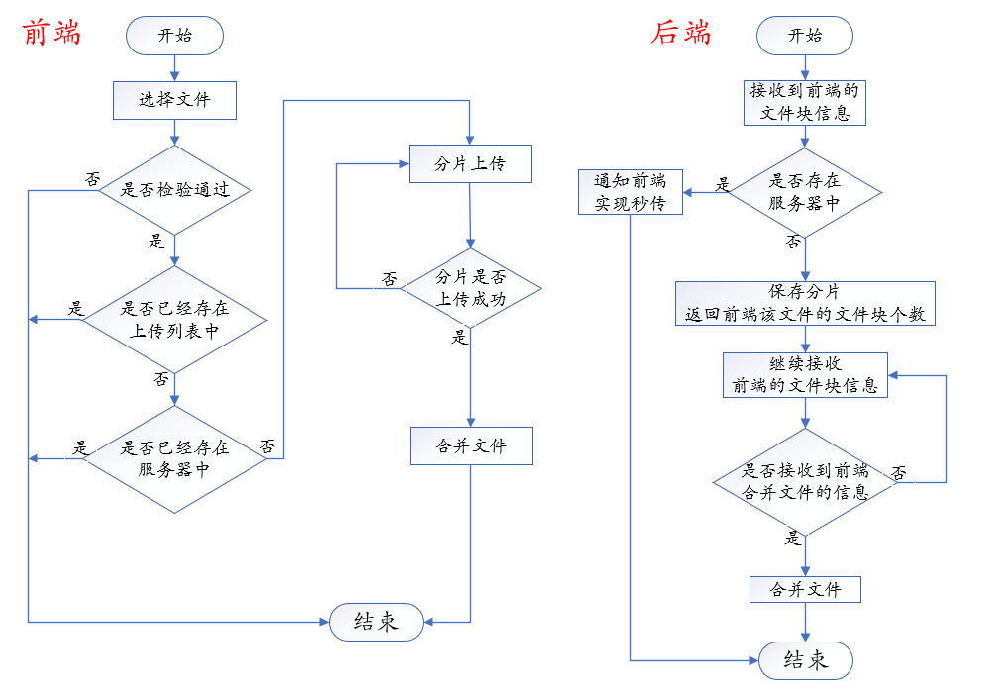
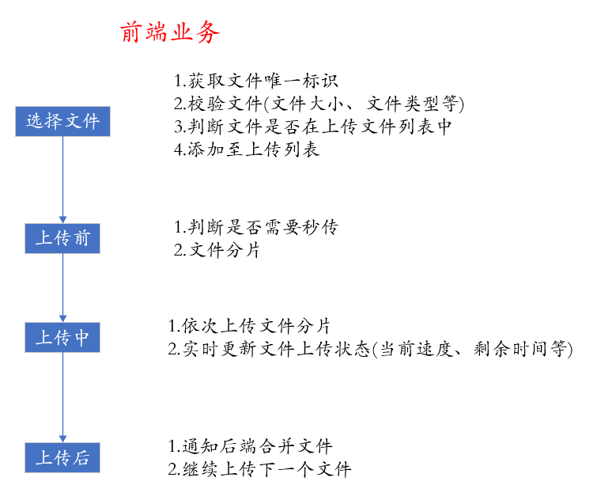

# 项目概述
&emsp;&emsp;本项目主要解决大文件在网络传输(上传和下载)时遇到的以下问题：   
1. 大文件直接上传，系统会占用大量的内存，从而可能导致内存溢出等问题。
2. 如果网络环境不好，可能会导致传输过程中断，且无法继续传输，只能重新传输。
3. 传输过程中无法知道传输进度、传输速度和剩余时间等信息。  

&emsp;&emsp;因此，针对上述问题，本项目根据对大文件进行**分片传输**的原理，实现网络传输的断点续传、秒传和显示传输过程的功能。   

# 项目技术栈
&emsp;&emsp;项目采用Web前后端分离的技术，为了简化开发，暂时不考虑数据库的设计。   
## Web前端
&emsp;&emsp;Web前端框架: Vue 3.2.47   
&emsp;&emsp;Web前端构建工具: Vite 3.1.0  
&emsp;&emsp;网络请求库: Axios 1.4.0   
&emsp;&emsp;开发语言: Typescript 5.0.2  
&emsp;&emsp;开发工具: WebStorm 2023.1.2    
&emsp;&emsp;浏览器: Chrome/Microsoft Edge
## Web后端
&emsp;&emsp;Web后端框架: Spring Boot 2.5.9  
&emsp;&emsp;开发语言: java 11  
&emsp;&emsp;开发工具: IDEA 2023.1.2

# 关键技术实现
## 分片和合并
### 文件上传
&emsp;&emsp;在文件上传中，首先前端利用[Blob.slice(start?, end?, contentType?)](https://developer.mozilla.org/zh-CN/docs/Web/API/Blob/slice)方法对文件进行切分(File类继承于Blob类)并上传，然后后端将每次上传的分片存储在文件夹中，最后当前端将所有分片上传完成后，后端遍历所有的分片，通过[Files.write(Path path, byte[] bytes, OpenOption options)](https://www.apiref.com/java11-zh/java.base/java/nio/file/Files.html#write(java.nio.file.Path,byte%5B%5D,java.nio.file.OpenOption...))方法并以追加的形式生成新的文件。    
### 文件下载  
&emsp;&emsp;在文件下载中，首先前端获取到下载文件的大小。然后根据文件大小和分片的大小，得到每次需要下载的长度范围，并将该范围通过http的headers对象传递给后端，后端利用FileInputStream将文件转为文件流的形式并根据得到的长度范围利用inputStream.skip()跳过之前下载的部分，然后将需要下载的文件流发送至前端。     
&emsp;&emsp;前端将每次下载好的文件块存储到数组中，最后下载完成时，利用Blob(array, options)转为文件并下载到本地。

## 续传

# 文件上传模块
## 业务流程
    
&emsp;&emsp;首先用户选择需要上传的文件，然后前端将文件信息发送至后端校验，如果已经存在，则通知前端秒传，否则将已经上传好的文件块序号返回至前端，然后前端将文件分片，并将需要上传的文件块发送至后端，最后当前端上传完成时通知后端合并文件。    

## 技术实现
&emsp;&emsp;文件上传模块的工作主要集中在Web前端，需要对文件进行分片控制并传输至后端，还需要针对后端返回的数据进行传输过程的可视化显示，而后端只需要保存分片和在最后阶段进行合并分片即可。   
### Web前端
&emsp;&emsp;整个上传过程大概可以分为上传前、上传中和上传后三部分。    
      
&emsp;&emsp;根据业务需求，分为文件上传器类Uploader、上传文件类UpLoadFile和文件块类Chunk，通过配置项对象的形式传递所需参数，通过事件订阅和发布的形式传递文件上传时的信息，并利用Vue框架的reactive响应式实现页面数据的实时刷新。    
&emsp;&emsp;通过Promise封装网络请求Axios，并利用Promise.all()实现多文件块同时上传。    

### Web后端